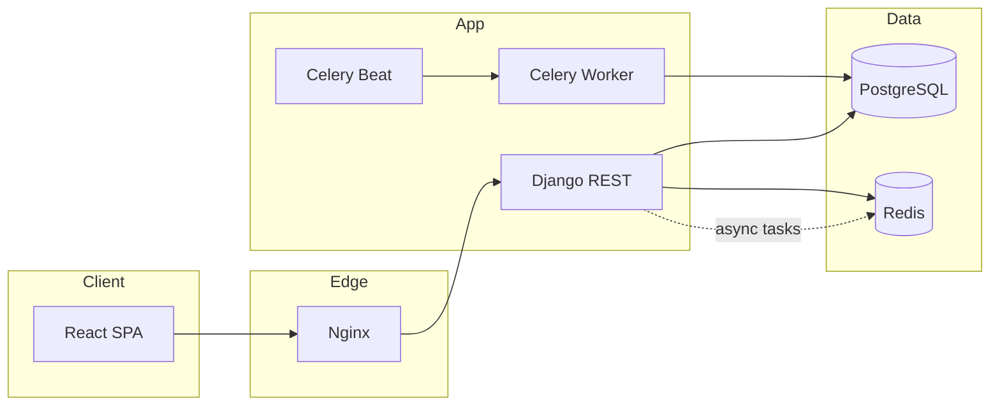

<div align="center">

# TimeWise

**Vaqt hisobi, loyihalar, hisob-faktura va rentabellik — bitta platformada.**  
To‘g‘ridan-to‘g‘ri *Toggl Track / Harvest / Clockify* darajasidagi **self-hosted** time tracking & billing SaaS.

[](https://www.python.org/)
[](https://www.djangoproject.com/)
[](https://www.django-rest-framework.org/)
[](https://react.dev/)
[](https://www.postgresql.org/)
[](https://redis.io/)
[](https://docs.celeryq.dev/)

[](docker-compose.yml)
[](nginx/nginx.conf)
[](backend/config/settings/base.py)
[](LICENSE)

</div>

---

## Mundarija

1. [Loyiha haqida](#1-loyiha-haqida)
2. [Asosiy imkoniyatlar](#2-asosiy-imkoniyatlar)
3. [Texnologik stack](#3-texnologik-stack)
4. [Repozitoriy tuzilmasi](#4-repozitoriy-tuzilmasi)
5. [Arxitektura va ishlash prinsipi](#5-arxitektura-va-ishlash-prinsipi)
6. [Domen modeli](#6-domen-modeli)
7. [Docker Compose xizmatlari](#7-docker-compose-xizmatlari)
8. [Tezkor ishga tushirish](#8-tezkor-ishga-tushirish)
9. [Asosiy buyruqlar](#9-asosiy-buyruqlar)
10. [Qo‘lda ishga tushirish (frontend / backend)](#10-qolda-ishga-tushirish-frontend--backend)
11. [Konfiguratsiya va muhit o‘zgaruvchilari](#11-konfiguratsiya-va-muhit-ozgaruvchilari)
12. [API, navbatlar va integratsiya](#12-api-navbatlar-va-integratsiya)
13. [Monitoring va ekspluatatsiya](#13-monitoring-va-ekspluatatsiya)
14. [CI/CD](#14-cicd)
15. [Xavfsizlik va fayl saqlash](#15-xavfsizlik-va-fayl-saqlash)
16. [Production komponentlari roli](#16-production-komponentlari-roli)
17. [Litsenziya](#17-litsenziya)
18. [Qo‘llab-quvvatlash](#18-qollab-quvvatlash)

---

## 1. Loyiha haqida

**TimeWise** — jamoalar va agentliklar uchun mo‘ljallangan **multi-tenant SaaS-platforma**: vaqt yozish, loyiha boshqaruvi, mijozlarga hisob-faktura chiqarish, xarajatlar va **rentabellik tahlili** bitta **web-interfeys** va **REST API** orqali.

Platforma quyidagilarni qamrab oladi:

- **Timer va qo‘lda yozuvlar** — real vaqt rejimida start/stop
- **Loyiha va vazifalar** — byudjet, jamoa, billing turlari
- **Hisob-faktura** — PDF, to‘lovlar, eslatmalar
- **Haftalik timesheet** — ko‘p bosqichli tasdiqlash
- **Hisobotlar** — utilization, profitability, budget tracking

### Bu qanday turdagi tizim?

TimeWise **monolit emas**, balki **taqsimlangan multi-servis platforma**: Django API, React SPA, Celery worker/beat, PostgreSQL, Redis va Nginx reverse proxy birgalikda ishlaydi.

| Aspekt | Tavsif |
|--------|--------|
| **Mahsulot** | B2B SaaS — agentliklar, konsalting, IT jamoalar uchun time & billing |
| **Arxitektura** | Django REST API + React SPA + Celery + Nginx |
| **Ma’lumotlar** | PostgreSQL (metadata), Redis (cache/broker), volume/S3 (media) |
| **Kirish** | JWT (SimpleJWT), email asosida autentifikatsiya |
| **Izolyatsiya** | `Organization` darajasida multi-tenancy |

---

## 2. Asosiy imkoniyatlar

| Modul | Imkoniyat |
|-------|-----------|
| **Time Tracking** | Timer, manual entry, bulk create, stale timer auto-stop |
| **Projects** | Client, task, budget, a’zolar, hourly/fixed/retainer billing |
| **Invoicing** | PDF, to‘lov yozuvi, overdue tekshiruvi, Stripe integratsiya tayyorligi |
| **Expenses** | Kategoriyalar, chek yuklash, billable/non-billable |
| **Timesheets** | Haftalik yig‘ma, submit/approve/reject workflow |
| **Reports** | Profitability, utilization, project summary, haftalik avto-hisobot |
| **Accounts** | Organization, Team, rollar (Owner → Viewer), BillingRate ierarxiyasi |
| **Notifications** | Celery orqali email va tizim bildirishnomalari |

---

## 3. Texnologik stack

### Backend

| Texnologiya | Versiya / Maqsad |
|-------------|------------------|
| Python | 3.12+ |
| Django | 5.0.6 |
| Django REST Framework | 3.15 |
| SimpleJWT | Token auth + blacklist |
| drf-spectacular | OpenAPI / Swagger / ReDoc |
| Celery + django-celery-beat | Background & periodic tasks |
| Gunicorn | Production WSGI |
| ReportLab / WeasyPrint | PDF generatsiya |

### Frontend

| Texnologiya | Maqsad |
|-------------|--------|
| React 18 | SPA interfeys |
| Redux Toolkit | Global state |
| TypeScript | API client, komponentlar |
| Recharts | Dashboard grafiklari |

### Infratuzilma

| Texnologiya | Maqsad |
|-------------|--------|
| PostgreSQL 16 | Asosiy ma’lumotlar bazasi |
| Redis 7 | Cache, Celery broker |
| Nginx 1.25 | Reverse proxy, static/media, rate limit |
| Docker Compose | Mahalliy va production deploy |

---

## 4. Repozitoriy tuzilmasi

```
TimeWise/
├── backend/                    # Django REST API
│   ├── apps/
│   │   ├── accounts/           # User, Organization, Team, BillingRate
│   │   ├── time_entries/       # TimeEntry, Timer, TimeApproval
│   │   ├── projects/           # Project, Task, Client, Budget
│   │   ├── clients/            # Client API marshrutlari
│   │   ├── invoicing/          # Invoice, Payment, PDF
│   │   ├── expenses/           # Expense, Receipt
│   │   ├── timesheets/         # WeeklyTimesheet, approval
│   │   ├── reports/            # Profitability, utilization
│   │   └── notifications/      # Bildirishnomalar
│   ├── config/
│   │   ├── settings/           # base, dev, prod
│   │   ├── urls.py
│   │   └── celery.py
│   ├── utils/
│   ├── Dockerfile
│   ├── manage.py
│   └── requirements.txt
├── frontend/                   # React SPA
│   ├── src/
│   │   ├── api/                # client, endpoints
│   │   ├── components/         # timer, projects, invoices, ...
│   │   ├── pages/                # Dashboard, Settings
│   │   ├── hooks/
│   │   └── store/
│   └── public/
├── nginx/
│   └── nginx.conf              # Proxy, gzip, rate limiting
├── docker-compose.yml
├── .env.example
└── README.md
```

---

## 5. Arxitektura va ishlash prinsipi

### Yuqori darajadagi sxema

```
                         ┌─────────────┐
                         │    Nginx    │
                         │  :80 / :443 │
                         └──────┬──────┘
                                │
              ┌─────────────────┴─────────────────┐
              │                                   │
       ┌──────▼──────┐                    ┌───────▼───────┐
       │  React SPA  │                    │  Django API   │
       │   :3000     │◄── REST / JWT ────►│    :8000      │
       └─────────────┘                    └───────┬───────┘
                                                   │
                    ┌──────────────────────────────┼──────────────────────────────┐
                    │                              │                              │
             ┌──────▼──────┐              ┌───────▼───────┐              ┌───────▼────────┐
             │ PostgreSQL  │              │     Redis     │              │ Celery Worker  │
             │   :5432     │              │    :6379      │              │  + Celery Beat │
             └─────────────┘              └───────────────┘              └────────────────┘
```

### So‘rov oqimi (qisqa)

1. Foydalanuvchi **React** orqali kiradi → JWT olinadi (`/api/auth/login/`).
2. Barcha biznes so‘rovlar **Django REST** ga yo‘naltiriladi; `organization` scope filtrlari qo‘llanadi.
3. Og‘ir ishlar (**PDF**, **email**, **hisobotlar**) **Celery** navbatiga tushadi.
4. **Nginx** static/media fayllarni xizmat qiladi va API uchun rate limit qo‘yadi.

### Mermaid — ma’lumot oqimi



---

## 6. Domen modeli

### Asosiy obyektlar

| Model | App | Vazifasi |
|-------|-----|----------|
| `Organization` | accounts | Tenant — barcha ma’lumot shu yerda izolyatsiya qilinadi |
| `User` | accounts | Email login, rollar, `weekly_capacity_hours` |
| `Team` | accounts | Jamoa guruhlari |
| `BillingRate` | accounts | Org / user / project darajasidagi stavkalar |
| `Client` | projects | Mijoz kartochkasi |
| `Project` | projects | Loyiha, byudjet, billing turi |
| `Task` | projects | Vazifa, assignee, estimated hours |
| `TimeEntry` | time_entries | Vaqt yozuvi, billable/cost hisoblash |
| `Timer` | time_entries | Faol timer (user uchun bitta) |
| `Invoice` | invoicing | Hisob-faktura, PDF, to‘lov holati |
| `Expense` | expenses | Xarajat + receipt |
| `WeeklyTimesheet` | timesheets | Haftalik yig‘ma va approval |

### BillingRate ierarxiyasi

```
user + project  →  eng yuqori ustuvorlik
     project     →
        user      →
  organization    →  default fallback
```

### TimeEntry holatlari

`draft` → `submitted` → `approved` / `rejected` → `invoiced` → `locked`

---

## 7. Docker Compose xizmatlari

| Xizmat | Image / Build | Port | Vazifasi |
|--------|---------------|------|----------|
| `db` | postgres:16-alpine | 5432 | Asosiy DB, healthcheck |
| `redis` | redis:7-alpine | 6379 | Cache + Celery broker |
| `backend` | `./backend` | 8000 | Gunicorn, migrate, collectstatic |
| `celery_worker` | `./backend` | — | Background tasks |
| `celery_beat` | `./backend` | — | Rejalashtirilgan vazifalar |
| `frontend` | `./frontend` | 3000 | React dev server |
| `nginx` | nginx:1.25-alpine | 80, 443 | Reverse proxy |

**Volumes:** `postgres_data`, `redis_data`, `static_files`, `media_files`

---

## 8. Tezkor ishga tushirish

### Talablar

- [Docker](https://docs.docker.com/get-docker/) va Docker Compose
- [Git](https://git-scm.com/)

### Docker bilan (tavsiya etiladi)

```bash
# 1. Klonlash
git clone https://github.com/NodirOdilov/TimeWise.git
cd TimeWise

# 2. Muhit fayli
cp .env.example .env

# 3. Barcha xizmatlarni ko‘tarish
docker compose up --build -d

# 4. Superuser (bir marta)
docker compose exec backend python manage.py createsuperuser
```

> `docker-compose.yml` ichida `backend` xizmati `migrate` va `collectstatic` ni avtomatik bajaradi.

### Kirish nuqtalari

| Resurs | URL |
|--------|-----|
| Frontend | http://localhost:3000 |
| API | http://localhost:8000/api/ |
| Swagger UI | http://localhost:8000/api/docs/ |
| ReDoc | http://localhost:8000/api/redoc/ |
| Admin | http://localhost:8000/admin/ |
| Nginx (proxy) | http://localhost |

---

## 9. Asosiy buyruqlar

Makefile yo‘q — quyidagi **Docker Compose** buyruqlari kundalik ish uchun yetarli:

```bash
# Xizmatlarni ko‘tarish / to‘xtatish
docker compose up -d
docker compose down

# Loglarni kuzatish
docker compose logs -f backend
docker compose logs -f celery_worker

# Migratsiya
docker compose exec backend python manage.py migrate

# Shell
docker compose exec backend python manage.py shell

# Testlar
docker compose exec backend python manage.py test

# Celery holati
docker compose exec celery_worker celery -A config inspect active
```

---

## 10. Qo‘lda ishga tushirish (frontend / backend)

### Backend

```bash
cd backend
python -m venv venv

# Windows
venv\Scripts\activate
# Linux / macOS
source venv/bin/activate

pip install -r requirements.txt
set DJANGO_SETTINGS_MODULE=config.settings.dev   # Windows
# export DJANGO_SETTINGS_MODULE=config.settings.dev  # Unix

python manage.py migrate
python manage.py runserver
```

> PostgreSQL va Redis alohida ishga tushirilgan bo‘lishi kerak (yoki faqat `db` + `redis` konteynerlarini `docker compose up db redis -d` bilan ko‘taring).

### Frontend

```bash
cd frontend
npm install
npm start
```

`.env` da `REACT_APP_API_URL=http://localhost:8000/api` bo‘lishi shart.

### Celery (ixtiyoriy, mahalliy)

```bash
cd backend
celery -A config worker -l info
celery -A config beat -l info --scheduler django_celery_beat.schedulers:DatabaseScheduler
```

---

## 11. Konfiguratsiya va muhit o‘zgaruvchilari

`.env.example` dan nusxa oling va production uchun **barcha maxfiy qiymatlarni** almashtiring.

| O‘zgaruvchi | Tavsif | Default (dev) |
|-------------|--------|---------------|
| `DJANGO_SETTINGS_MODULE` | Settings moduli | `config.settings.dev` |
| `SECRET_KEY` | Django secret | *o‘zgartiring* |
| `DEBUG` | Debug rejimi | `True` |
| `ALLOWED_HOSTS` | Ruxsat etilgan hostlar | `localhost,127.0.0.1` |
| `DATABASE_URL` | PostgreSQL connection | `postgresql://...@db:5432/timewise` |
| `REDIS_URL` | Cache | `redis://redis:6379/0` |
| `CELERY_BROKER_URL` | Celery broker | `redis://redis:6379/1` |
| `CORS_ALLOWED_ORIGINS` | Frontend origin | `http://localhost:3000` |
| `REACT_APP_API_URL` | Frontend API base | `http://localhost:8000/api` |
| `EMAIL_*` | SMTP (hisob-faktura, eslatmalar) | — |
| `AWS_*` | S3 media (production) | — |
| `STRIPE_*` | To‘lov integratsiyasi | — |
| `SENTRY_DSN` | Xato monitoring | — |

**Production:** `DJANGO_SETTINGS_MODULE=config.settings.prod`, `DEBUG=False`, kuchli `SECRET_KEY`, SSL (nginx), S3 storage.

---

## 12. API, navbatlar va integratsiya

### API prefikslari

| Prefiks | Modul |
|---------|-------|
| `/api/auth/` | Ro‘yxatdan o‘tish, login, JWT refresh, profil |
| `/api/time-entries/` | Vaqt yozuvlari, timer start/stop |
| `/api/projects/` | Loyihalar, byudjet, summary |
| `/api/clients/` | Mijozlar |
| `/api/invoices/` | Hisob-fakturalar, PDF, to‘lov |
| `/api/expenses/` | Xarajatlar |
| `/api/timesheets/` | Haftalik timesheet |
| `/api/reports/` | Profitability, utilization |

To‘liq sxema: **Swagger** → `/api/docs/`

### Autentifikatsiya (misol)

```http
POST /api/auth/login/
Content-Type: application/json

{ "email": "user@example.com", "password": "••••••••" }
```

```http
Authorization: Bearer <access_token>
```

### Celery Beat — rejalashtirilgan vazifalar

| Vazifa | Jadval | Maqsad |
|--------|--------|--------|
| `check_overdue_invoices` | Har kuni 09:00 | Muddati o‘tgan hisob-fakturalar |
| `send_timesheet_reminders` | Juma 09:00 | Timesheet eslatmalari |
| `generate_weekly_reports` | Dushanba 06:00 | Haftalik hisobotlar |
| `auto_stop_stale_timers` | Har soat | Uzoq ishlayotgan timerlarni to‘xtatish |

### Integratsiya tayyorligi

| Xizmat | Maqsad |
|--------|--------|
| **Stripe** | Onlayn to‘lov (`STRIPE_*`) |
| **AWS S3** | Media / receipt saqlash |
| **SMTP** | Email bildirishnomalar |
| **Sentry** | Production xato kuzatuvi |

---

## 13. Monitoring va ekspluatatsiya

```bash
# Konteyner holati
docker compose ps

# Backend health (API schema)
curl -s -o /dev/null -w "%{http_code}" http://localhost:8000/api/schema/

# PostgreSQL
docker compose exec db pg_isready -U timewise

# Redis
docker compose exec redis redis-cli ping
```

**Loglar:** `docker compose logs -f` — barcha xizmatlar; productionda log aggregator (Loki, ELK) ulash tavsiya etiladi.

**Backup:** `postgres_data` volume va `media_files` muntazam zaxiralanishi kerak.

---

## 14. CI/CD

Hozircha repozitoriyada `.github/workflows` yo‘q — quyidagi pipeline tavsiya etiladi:

```yaml
# .github/workflows/ci.yml (namuna)
# - backend: pytest / manage.py test
# - frontend: npm test && npm run build
# - docker: build & push image
# - deploy: SSH / Kubernetes / Compose on VPS
```

Production deploy qadamlari:

1. `.env` production qiymatlari
2. `DJANGO_SETTINGS_MODULE=config.settings.prod`
3. `nginx/nginx.conf` — domen va SSL
4. `docker compose up -d --build`

---

## 15. Xavfsizlik va fayl saqlash

| Soha | Yechim |
|------|--------|
| **Auth** | JWT + refresh blacklist (SimpleJWT) |
| **CORS** | Faqat ruxsat etilgan originlar |
| **Rate limit** | Nginx: API 30 r/s, login 5 r/m |
| **Multi-tenancy** | Barcha querysetlar `organization` bo‘yicha filtrlangan |
| **Media** | Dev: volume; Prod: S3 (`django-storages`) |
| **HTTPS** | Nginx SSL bloki (productionda yoqing) |
| **Secrets** | `.env` gitga kirmaydi — `.gitignore` |

> Hech qachon `.env`, `SECRET_KEY`, Stripe yoki AWS kalitlarini repozitoriyaga commit qilmang.

---

## 16. Production komponentlari roli

| Komponent | Productiondagi roli |
|-----------|---------------------|
| **Nginx** | TLS termination, static/media, load balancing, rate limit |
| **Gunicorn** | WSGI, ko‘p worker/thread |
| **Celery Worker** | PDF, email, hisobot generatsiyasi |
| **Celery Beat** | Vaqtli vazifalar (invoice, timesheet, timer) |
| **PostgreSQL** | ACID, relational data, backup |
| **Redis** | Broker + cache, tez sessiya/cache |
| **S3** | Cheklar, avatar, invoice PDF arxivi |

---

## 17. Litsenziya

Loyiha **MIT License** ostida tarqatiladi. Tafsilotlar uchun `LICENSE` faylini qo‘shing yoki mavjud litsenziya faylini ko‘ring.

---

## 18. Qo‘llab-quvvatlash

| Kanal | Maqsad |
|-------|--------|
| [GitHub Issues](https://github.com/NodirOdilov/TimeWise/issues) | Bug va feature so‘rovlari |
| [Discussions](https://github.com/NodirOdilov/TimeWise/discussions) | Savol-javob, g‘oyalar |
| API Docs | `/api/docs/` — interaktiv Swagger |

**Muammo bo‘lsa:** issue oching, `docker compose logs` va `.env` (maxfiy qismlarsiz) ni ilova qiling.

---

<div align="center">

**TimeWise** — vaqtingizni hisoblang, pulingizni nazorat qiling.

*Made with care for teams that bill by the hour.*

</div>
